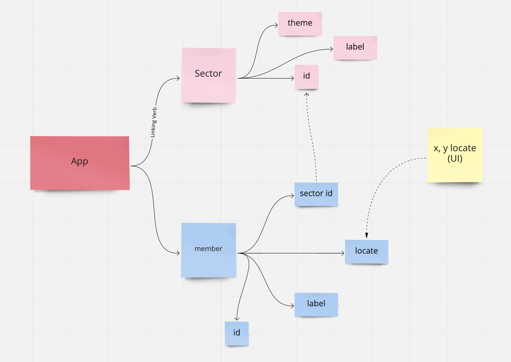

# Push Push
Side project for learn React ecosystem 😇

## Stacks
- view : react
- store : recoil
- icons : react icons
- mock data fetch : msw (wip..)

## Tutorial

## Data modeling

## Spec
ref. https://github.com/mitrvlr/playing-cards/issues/3
